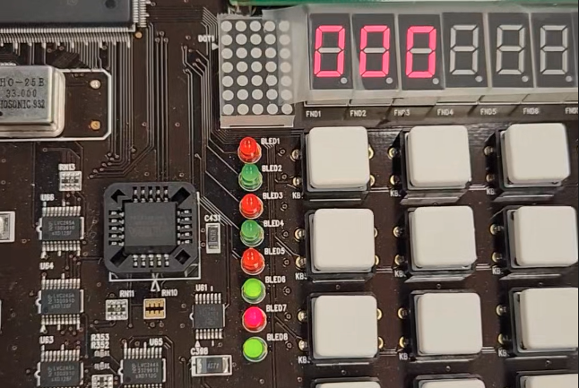
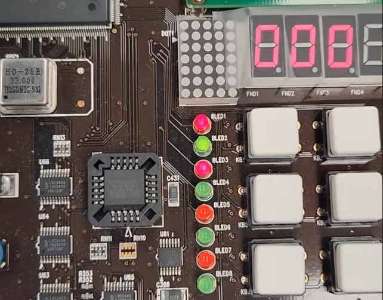
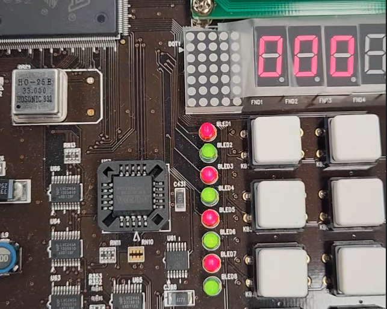

# 
P2 LED 점등 실습 결과보고서

 3조 20162581 손승표 

  

## 실험과정
1. 교재의 코드들 대로 생성
2. make로 컴파일
3. minicom으로 장비 접속
4. output파일인 led를 송신
5. 장비에서 ./led로 실행

## a. 프로그램을 실행한 후, 1, 2, 3, 0번을 눌러 각각의 기능을 실행했을 때, 장비는 어떤 반응을 보일 것으로 예상하는가?

### 1번 :

  - 아래부터 차례로 불이 켜지다가, 다 켜진 후, 아래부터 차례로 다시 꺼진다
  - **led_up_shift** 함수가 호출된다.
    - 0xFF이던 led 값이, for 문에 의해 차례로 왼쪽부터 0이 들어오다가, 0으로 다 채워진 후에는, 다시 1이 왼쪽부터 들어온다.

### 2번 :

  - 위에부터 차례로 불이 켜지다가, 다 켜진 후, 위에부터 차례로 다시 꺼진다
  - **led_down_shift** 함수가 호출된다.
    - 0xFF이던 led 값이, for 문에 의해 차례로 오른쪽부터 0이 들어오다가, 0으로 다 채워진 후에는, 다시 1이 왼쪽부터 들어온다.

### 3 번 :

  - 16번 깜빡인다.
  - **led_blink_all** 함수가 호출된다.
    - modular 연산을 이용해 짝수번일 때 키고 홀수번 일 때 끈다.

- 0 번:
  - 프로그램 종료
  - while문 조건에 의해 반복문 탈출 후 프로그램 정상 종료
  

## b. led 함수들(led_down_shift, led_up_shift)에서 shift연산을 하는 이유는 무엇인가?

- shift 연산에 의해 led의 8bit공간을 ~0xFF값이 지나가면서 불을 켜줄 수가 있다.
  - led_down_shift는 오른쪽에서부터 왼쪽으로 지나간다.
  - led_up_shift는 왼쪽에서부터 오른쪽으로 지나간다.
  

## c. led 함수들(led_down_shift, led_up_shift, led_blink_all)에서 값을 쓰기 전에 항상 비트를 반전한다. 그 이유는 무엇인가?

- led는 0값일 때 불이 켜지고, 1 값일 때 불이 꺼지기 때문이다.
  - 우리는 보통 1을 true, 0을 false로 생각하기 때문에, 우리가 헷갈리지 않기 위해서 0xFF값을 반전시켜 활용한다.
  

## d. usleep()함수를 사용하는 이유를 설명하고, 만약 usleep()함수를 사용하지 않는다면 어떻게 될지 예상해보자.

- 매우 빠른 시간에 불이 들어왔다가 꺼지기 때문에, 모든 모드에서 단순히 불이 들어왔었다고 알거나, 아예 불이 들어온줄도 모르게 끝나버릴 것이다.

    - usleep()은 마이크로초 동안 대기시키는 함수이다.
    - led가 육안으로 불이 차례로 들어오는 것을 확인하기 위해 일부러 delay시키려 해당 함수를 활용하였다.
    - 따라서 usleep()을 활용하지 않는다면, 모든 코드들이 delay없이 진행되어 불의 점등을 제대로 알 수 없다.
